# BohaiServiceDome 

在用户通过登录进入渤海大学服务站主界面时，主界面中包括基本的功能：首页、服务、学习、个人中心。首页界面主要包括广告轮播、校园服务、定位签到、校友圈。服务界面主要包括校内通知、失物招领、渤大表白墙。学习界面主要包括每日一句、题库。我的界面主要包括更换头像、个人信息、密码设置、我的签到、退出登录等

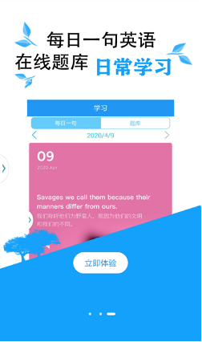
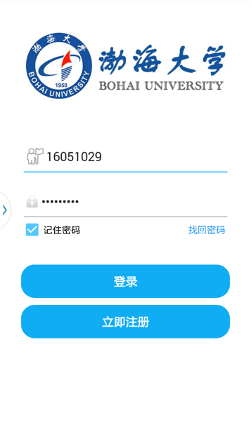
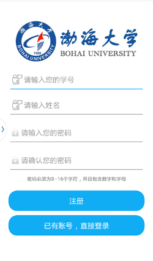
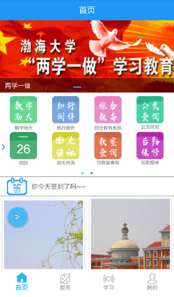
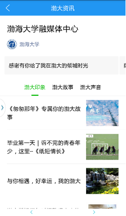
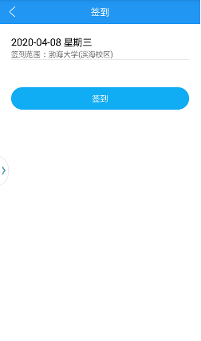
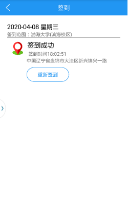
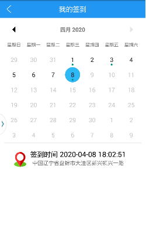
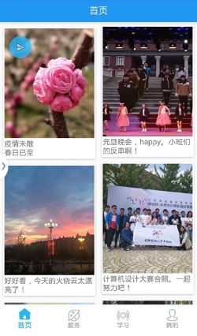
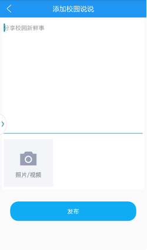

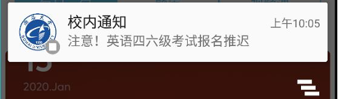
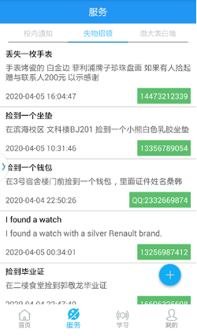
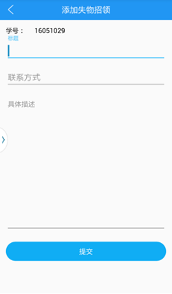

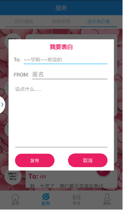
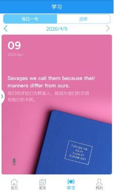
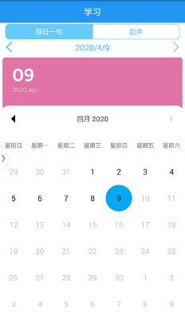
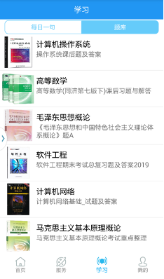
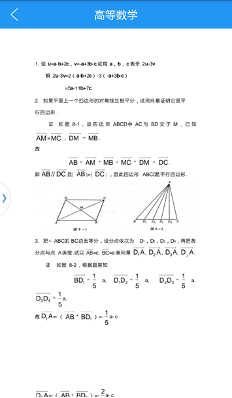
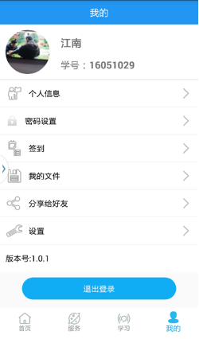
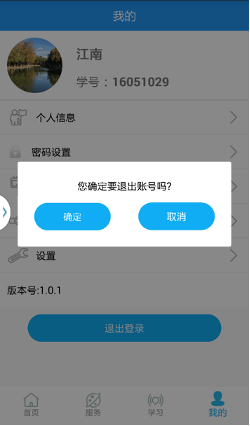
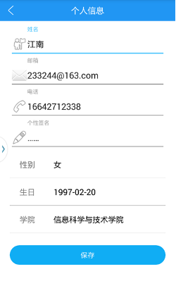
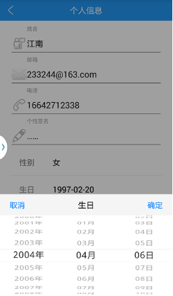
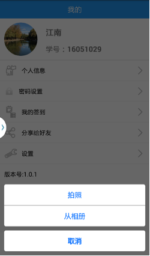
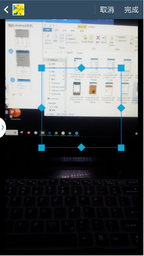
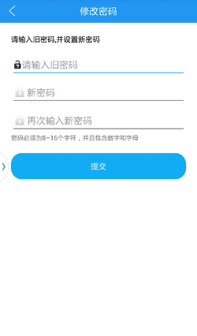

 
*已经申请软件著作权，仅供参考学习使用*

